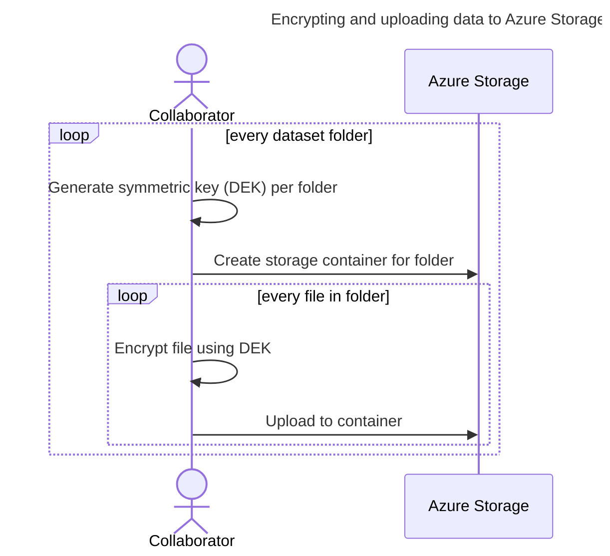

# Azure Clean Room Big Data Samples <!-- omit from toc -->

This repository demonstrates usage of an [Azure **_Confidential Clean Room_** (**CCR**)](https://github.com/Azure/azure-cleanroom) for big data multi-party collaboration.

# Table of Contents <!-- omit from toc -->
<!--
  DO NOT UPDATE THIS MANUALLY

  The TOC is managed using the "Markdown All in One" extension.
  Use the extension commands to auto-update the TOC and section numbers.
-->
- [Overview](#overview)
- [Samples environment (per collaborator)](#samples-environment-per-collaborator)
  - [Bringing up the environment](#bringing-up-the-environment)
  - [Initializing the environment](#initializing-the-environment)
- [Setting up the clean room infrastructure](#setting-up-the-clean-room-infrastructure)
  - [Consortium creation (operator)](#consortium-creation-operator)
  - [Cleanroom environment creation (operator)](#cleanroom-environment-creation-operator)
- [Setting up the collaborators](#setting-up-the-collaborators)
  - [User identity creation (northwind, woodgrove)](#user-identity-creation-northwind-woodgrove)
  - [Invite users to the consortium (operator)](#invite-users-to-the-consortium-operator)
  - [Accepting invitations (northwind, woodgrove)](#accepting-invitations-northwind-woodgrove)
- [Publishing data](#publishing-data)
  - [Azure: KEK-DEK based encryption approach](#azure-kek-dek-based-encryption-approach)
  - [S3: Setup AWS credentials (woodgrove)](#s3-setup-aws-credentials-woodgrove)
  - [Upload data (northwind, woodgrove)](#upload-data-northwind-woodgrove)
  - [Configure resource access for clean room (northwind, woodgrove)](#configure-resource-access-for-clean-room-northwind-woodgrove)
- [Setting up query execution](#setting-up-query-execution)
  - [Governance UI (northwind, woodgrove)](#governance-ui-northwind-woodgrove)
  - [Adding query to execute in the collaboration (woodgrove)](#adding-query-to-execute-in-the-collaboration-woodgrove)
  - [Agreeing upon the query for execution (northwind, woodgrove)](#agreeing-upon-the-query-for-execution-northwind-woodgrove)
- [Using the clean room](#using-the-clean-room)
  - [Executing the query (woodgrove)](#executing-the-query-woodgrove)
  - [View output (woodgrove)](#view-output-woodgrove)
- [Advanced Topics](#advanced-topics)
  - [How do I specify a date range for query execution ?](#how-do-i-specify-a-date-range-for-query-execution-)
  - [How do I switch between demos? (northwind, woodgrove)](#how-do-i-switch-between-demos-northwind-woodgrove)
  - [How do I cleanup the environment to create a brand new/fresh setup?](#how-do-i-cleanup-the-environment-to-create-a-brand-newfresh-setup)
- [Troubleshooting](#troubleshooting)
  - [Hitting `TaskCanceledException` or `HttpRequestException` error during `run-query.ps1`](#hitting-taskcanceledexception-or-httprequestexception-error-during-run-queryps1)
  - [The containers backing the various personas stopped. How to re-start them and resume the workflow?](#the-containers-backing-the-various-personas-stopped-how-to-re-start-them-and-resume-the-workflow)
  - [Failure/need help?](#failureneed-help)

# Overview

End to end demos showcasing scenario oriented usage:

|                     |                 `analytics-sse`             |                       `analytics-s3-sse`                   |               `analytics-cpk`               |
| :------------------ | :-----------------------------------------: | :--------------------------------------------------------: | :-----------------------------------------: |
| _**Collaboration**_ |                                             |                                                            |                                             |
| Data Source         | :heavy_check_mark: Azure Blob Storage (SSE) | :heavy_check_mark: Azure Blob Storage (SSE) & AWS S3 (SSE) | :heavy_check_mark: Azure Blob Storage (CPK) |
| Data Sink           | :heavy_check_mark: Azure Blob Storage (SSE) |              :heavy_check_mark: AWS S3 (SSE)               | :heavy_check_mark: Azure Blob Storage (CPK) |
| Data Access         |             :heavy_check_mark:              |                     :heavy_check_mark:                     |             :heavy_check_mark:              |
| Query Execution     |             :heavy_check_mark:              |                     :heavy_check_mark:                     |             :heavy_check_mark:              |
| _**Governance**_    |                                             |                                                            |                                             |
| Contract            |             :heavy_check_mark:              |                     :heavy_check_mark:                     |             :heavy_check_mark:              |
| Document Store      |             :heavy_check_mark:              |                     :heavy_check_mark:                     |             :heavy_check_mark:              |
| Telemetry           |             :heavy_check_mark:              |                     :heavy_check_mark:                     |             :heavy_check_mark:              |
| Audit               |             :heavy_check_mark:              |                     :heavy_check_mark:                     |             :heavy_check_mark:              |
| Identity Provider   |             :heavy_check_mark:              |                     :heavy_check_mark:                     |             :heavy_check_mark:              |
| CA                  |             :heavy_check_mark:              |                     :heavy_check_mark:                     |             :heavy_check_mark:              |

<br>

<!--TODO: Add links to corresponding readme in product repo for each capability.-->
The demo shows collaborations where one or more of the following parties come together:
  - **_Northwind_**, collaborator owning sensitive dataset(s) that can be consumed by applications inside a CCR.
  - **_Woodgrove_**, collaborator that wants to run a query over the sensitive data along with bringing in any of its own sensitive dataset(s) for consumption inside a CCR.

The following parties are additionally involved in completing the end to end demo:
  - **_Operator_**, clean room provider hosting the CCR infrastructure.

In all cases, a CCR will be executed to run the application while protecting the privacy of all ingested data, as well as protecting any confidential output. The CCR instance can be deployed by the **_operator_**, any of the collaborators without any impact on the zero-trust promise architecture.

# Samples environment (per collaborator)
All the involved parties need to bring up a local environment to participate in the sample collaborations.

## Bringing up the environment
> [!NOTE]
> Prerequisites to bring up the environment
> * Docker installed locally. Installation instructions [here](https://docs.docker.com/engine/install/).
> * PowerShell installed locally. Installation instructions [here](https://learn.microsoft.com/en-us/powershell/scripting/install/installing-powershell).
>
> It is **recommended to use GitHub Codespaces** to create the local environment which would have the above prerequisites pre-installed.

Each party requires an independent environment. To create such an environment, open a separate powershell window for each party and run the following commands:


```powershell
$demo = # Set to one of: "analytics-sse" "analytics-s3-sse" "analytics-cpk"
$persona = # Set to one of: "operator" "northwind" "woodgrove"
```
<!-- TODO: Is it worthwhile adding a selector instead?
```powershell
function Choose-Option([string[]] $options, [string] $prompt) { 
  $displayString = "" 
  for ($i = 0; $i -lt $options.Length; $i++)
  {
    $displayString += "${i}: $($options[$i])$([environment]::NewLine)"
  } 
  $displayString += "Choose $prompt" 
  $choice=Read-Host $displayString 
  return $options[([convert]::ToInt32($choice))] 
} `
$persona = (Choose-Option -options @('operator','litware','northwind','woodgrove','client') -prompt 'persona')
```
-->

```powershell
./big-data/start-environment.ps1 -shareCredentials -persona $persona -demo $demo
```

This creates a separate docker container for each party that contains an isolated environment, while sharing some host volumes across all of them to simplify sharing 'public' configuration details across parties.

> [!IMPORTANT]
> For Azure environment the command configures the environment to use a randomly generated resource group name on every invocation. To control the name, or to reuse an existing resource group, pass it in using the `-resourceGroup` parameter.
> Do not use the same resource group name for different personas.


> [!TIP]
> For Azure environment the `-shareCredentials` switch above enables the experience for sharing Azure credentials across the sample environments of all the parties. This brings up a credential proxy container `azure-cleanroom-samples-credential-proxy` that performs a single interactive logon at the outset, and serves access tokens to the rest of the containers from here onwards.

## Initializing the environment
> [!NOTE]
> Prerequisites to initialize the environment:
> * **_Operator_**: An Azure subscription with adequate permissions to create resources and manage permissions on these resources.
> * **_Northwind_**: An Azure subscription with adequate permissions to create resources and manage permissions on these resources.
> * **_Woodgrove_**:  Depends on the demo being performed:  
>   `analytics-sse/analytics-cpk`: An Azure subscription with adequate permissions to create resources and manage permissions on these resources.  
>   `analytics-s3-sse`: An AWS account with an IAM user access key and secret which has adequate permissions to create/read/write S3 buckets.

Initialize the environment for executing the samples by executing the following command from the `/home/samples` directory for **every** persona:

```powershell
./scripts/initialize-environment.ps1
```

> [!NOTE]
> For using an Azure subscription, use the `-subscription` parameter in the command above to specify the subscription ID.

> [!IMPORTANT]
> The above script creates an Azure Storage account for OIDC usage when running for the `operator` persona. If you have a pre-configured Azure storage account for OIDC usage then supply that account name for the `operator` persona as follows:
> ```powershell
> $storageAccountName = <name>
> ./scripts/initialize-environment.ps1 -preProvisionedOIDCStorageAccount $storageAccountName
> ```
> For running this sample on MSFT (internal) tenants, you need to use the `preProvisionedOIDCStorageAccount` parameter in the above command to specify the name of a preprovisioned storage account, to be used for the OIDC configuration. This storage account has to be whitelisted to be used for Federation on Managed Identities using the process:
> 1. Create a static website in a storage account in your subscription and save the weburl using the steps outlined [here](https://learn.microsoft.com/en-us/azure/storage/blobs/storage-blob-static-website-how-to?tabs=azure-portal). This static website will be used for sharing OIDC public configs for the consortium
> 2. Create an ICM using the template: https://portal.microsofticm.com/imp/v3/incidents/create?tmpl=F332q2 and use that web URL to request the exception. The internal TSG for this exception is present [here](https://microsoft.sharepoint.com/teams/CSEOAAD/SitePages/Entra-ID-Application-Authentication-Methods-Policy.aspx?ct=1699632892251&or=Teams-HL&ga=1#msi-federated-identity-credential-policy).


Below is an example setup of 3 command prompts in which `start-environment` was executed before and now `initialize-environment` is about to be executed.


This command create the resource group and other Azure resources required for executing the samples such as a storage account, container registry and key vault (Premium).

> [!NOTE]
> All the steps henceforth assume that you are working in the `/home/samples` directory of the docker container, and commands are provided relative to that path.

<br>
<details><summary><em>Further details</em></summary>
<br>

The following Azure resources are created as part of initialization:
 - Storage Account for `northwind` and `woodgrove` environments to use as a backing store for clean room input and output.
 - Storage Account for `operator` environment to store federated identity token issuer details.
 - Storage Account with shared key access enabled for `operator` environment to use as a backing store for CCF deployments.
</details>
<br>

# Setting up the clean room infrastructure
> [!IMPORTANT]
> Ensure that you use the correct console window that corresponds to the persona for the commands mentioned below. The (`persona`) is called out in the section headings.

## Consortium creation (operator)
Collaboration using a CCR is realized and governed through a consortium created using [CCF](https://microsoft.github.io/CCF/main/overview/what_is_ccf.html) hosting a [Clean Room Governance Service (CGS)](https://github.com/Azure/azure-cleanroom/tree/main/src/governance). 

From a confidentiality perspective any of the collaborators or the *operator* can create the CCF instance without affecting the zero-trust assurances. In these samples, we assume that it was agreed upon that the *operator* will host the CCF instance. The *operator* would create the CCF instance and then invite all the collaborators as users into the consortium.

### Create the CCF instance <!-- omit from toc -->

The _operator_ (who is hosting the CCF instance) brings up a CCF instance using Confidential ACI by executing this command:

```powershell
./scripts/consortium/start-consortium.ps1
```

> [!NOTE]
> In the default sample environment, the containers for all participants have their `/home/samples/demo-resources/public` mapped to a single host directory, so details about the CCF endpoint would be available to all parties automatically once generated. If the configuration has been changed, the CCF details needs to made available in `/home/samples/demo-resources/public` of each member before executing subsequent steps.

The above script also creates the member identity for the operator of the CCF network by generating their public and private key pair. A CCF member is identified by a public-key certificate used for client authentication and command signing.

> [!IMPORTANT]
> 
> The member’s identity private key generated by the command (e.g. `operator_privk.pem`) should not be shared with anyone.
> It should be stored on a trusted device (e.g. HSM) and kept private at all times.

## Cleanroom environment creation (operator)

### Create the cluster instance <!-- omit from toc -->

The _operator_ (who is hosting the cleanroom infra) brings up AKS cluster instance to run the Analytics workload (query). This cluster uses pods backed by Confidential ACI. Cluster creation is done by executing this command:

```powershell
./scripts/cleanroom-cluster/start-cleanroom-cluster.ps1
```

> [!NOTE]
> In the default sample environment, the containers for all participants have their `/home/samples/demo-resources/public` mapped to a single host directory, so details about the cluster endpoint would be available to all parties automatically once generated. If the configuration has been changed, the CCF details needs to made available in `/home/samples/demo-resources/public` of each user before executing subsequent steps.

# Setting up the collaborators

## User identity creation (northwind, woodgrove)
The users in the collaboration are identified by their Microsoft account (work/school or Azure account). Their login id (eg `foo@outlook.com`) is required for adding them to the collaboration.

For demo purposes you can create Microsoft accounts by visiting [outlook.com](https://outlook.com), choosing *Sign In* and the *Create one* option.


After signing up for the accounts and choosing the email address each collaborator supplies their Microsoft account details by executing the following command:

```powershell
./scripts/consortium/share-user-identity.ps1 -email <email>
```

## Invite users to the consortium (operator)
The _operator_ (who is hosting the CCF instance) invites each user in the collaboration with the consortium using the identity details generated [above](#member-identity-creation-operator-litware-northwind-woodgrove).


```powershell
./scripts/consortium/invite-users.ps1
```

> [!NOTE]
> In the default sample environment, the containers for all participants have their `/home/samples/demo-resources/public` mapped to a single host directory, so this identity information would be available to all parties automatically once generated. If the configuration has been changed, the identity details of all other parties needs to made available in `/home/samples/demo-resources/public` of the _operator's_ environment before running the registration command above.

> [!TIP]
> To add a user to the consortium, one of the existing members is required to create a proposal for addition of the member, and a quorum of members are required to accept the same.
>
> In the default sample flows, the _operator_ is the **only** active member of the consortium at the time of inviting the members, allowing a simplified flow where the _operator_ can propose and accept all the collaborators up front. Any additional/out of band member registrations at a later time would require all the **active** members at that point to accept the new member.

## Accepting invitations (northwind, woodgrove)
Once the collaborators have been added, they now need to accept their invitation before they can participate in the collaboration.

```powershell
./scripts/consortium/accept-invitation.ps1
```

With the above steps the consortium creation that drives the creation and execution of the clean room is complete. We now proceed to preparing the datasets and making them available in the clean room.

> [!TIP]
> The same consortium can be used/reused for executing any/all the sample demos. There is no need to repeat these steps unless the collaborators have changed.

> [!NOTE]
> In the default sample environment, the containers for all participants have their `/home/samples/demo-resources/public` mapped to a single host directory, so details about the CCF endpoint would be available to all parties automatically once generated by the _operator_. If the configuration has been changed, the CCF details needs to made available in `/home/samples/demo-resources/public` of each member before executing subsequent steps.

# Publishing data
Sensitive data that any of the parties want to bring into the collaboration is ideally encrypted in a manner that ensures the key to decrypt this data will only be released to the clean room environment. This encryption is optional in case a collaborator does not want to use Client Side Encryption (CSE) or Customer Provided Key (CPK) for their data. This demo showcases the approach of using SSE and CPK. It does not yet demonstrate CSE.

## Azure: KEK-DEK based encryption approach
The non-SSE samples for Azure storage follow an envelope encryption model for encryption of data. For the encryption of the data, a symmetric **_Data Encryption Key_** (**DEK**) is generated. An asymmetric key, called the *Key Encryption Key* (KEK), is generated subsequently to wrap the DEK. The wrapped DEKs are stored in a Key Vault as a secret and the KEK is imported into an MHSM/Premium Key Vault behind a secure key release (SKR) policy. Within the clean room, the wrapped DEK is read from the Key Vault and the KEK is retrieved from the MHSM/Premium Key Vault following the secure key release [protocol](https://learn.microsoft.com/en-us/azure/confidential-computing/skr-flow-confidential-containers-azure-container-instance). The DEKs are unwrapped within the cleanroom and then used to access the storage containers.

### Encrypt and upload data (northwind, woodgrove) <!-- omit from toc -->
It is assumed that the collaborators have had out-of-band communication and have agreed on the data sets that will be shared. In these samples, the protected data is in the form of one or more files in one or more directories at each collaborators end.

For the CPK/CSE capability demo, these dataset(s) in the form of files are encrypted using the [KEK-DEK](#kek-dek-based-encryption-approach) approach and uploaded into the storage account created as part of [initializing the sample environment](#initializing-the-environment). Each directory in the source dataset would correspond to one Azure Blob storage container, and all files in the directory are uploaded as blobs to Azure Storage using specified encryption mode - client-side encryption ie CSE <!-- TODO: Add link to explanation of CSE. -->
/ server-side encryption using [customer provided key i.e. CPK](https://learn.microsoft.com/azure/storage/blobs/encryption-customer-provided-keys). Only one symmetric key (DEK) is created per directory (blob storage container).



## S3: Setup AWS credentials (woodgrove)
For the S3 demo (`analytics-s3-sse`) AWS credentials needs to be provided that has permissions to create/read/write buckets. These credentials will be used as follows:
- By the demo scripts to create buckets and upload data in them.
- By the clean room to access the buckets to read input datasets and create output datasets. A secret in CGS is created to store the credentials to make them available to the clean room.

Assuming a user was configured in AWS for this purpose, run the following command to setup the credentials supplying the access key and secret key information:
```powershell
$awsAccessKey="AKIA..."
$awsSecretKey="wJalrXUtnF..."
```
```powershell
Set-AWSCredential -AccessKey $awsAccessKey -SecretKey $awsSecretKey -StoreAs "default"
```

## Upload data (northwind, woodgrove)

The following command downloads demo data content that will be consumed by the query execution:

```powershell
./scripts/data/generate-data.ps1
```

The following command initializes datastores and uploads encrypted datasets required for executing the samples:

```powershell
./scripts/data/publish-data.ps1
```

> [!NOTE]
> This command seeds the environment with data from external sources in some of the samples. As a result, this step which could take some time.

<!-- TODO: Switch data sources and data sinks to CSE and drop this note.-->
> [!NOTE]
> The samples currently use server-side encryption for all data sets. However the clean room infrastructure supports client side encryption as well, and client side encryption is the recommended encryption mode as it offers a higher level of confidentiality.

> [!TIP]
> <a name="MountPoints"></a>
> During clean room execution, the datasources and datasinks get presented to the application as file system mount points using the [Azure Storage Blosefuse](https://github.com/Azure/azure-storage-fuse/tree/main?tab=readme-ov-file#about) driver or the [s3fs fuse](https://github.com/s3fs-fuse/s3fs-fuse) driver.
>
> The application reads/writes data from/to these mountpoint(s) in clear text. If CSE is configured (for Azure blob storage) then under the hood, the storage system is configured to handle all the cryptography semantics, and transparently decrypts/encrypt the data using the DEK corresponding to each datastore.

## Configure resource access for clean room (northwind, woodgrove)
All the collaborating parties need to give access to the clean room so that the clean room environment can access resources in their respective tenants.

The DEKs that were created for dataset encryption as part of [data publishing](#publishing-data) are now wrapped using a KEK generated for each contract. The KEK is uploaded in Key Vault and configured with a secure key release (SKR) policy while the wrapped-DEK is saved as a secret in Key Vault.

The managed identities created earlier as part of [publishing the data](#publishing-data) are given access to resources, and a federated credential is setup for these managed identities using the CGS OIDC identity provider. This federated credential allows the clean room to obtain an attestation based managed identity access token during execution.


```powershell
./scripts/contract/grant-cleanroom-access.ps1
```

# Setting up query execution

## Governance UI (northwind, woodgrove)

You can see various artifacts like the datasets / audit events / queries being managed in the consortium by opening the link displayed by the below script:
```powershell
./scripts/consortium/ui.ps1
```
```powershell
Open http://localhost:xxx in your browser to access the governance portal.
```

## Adding query to execute in the collaboration (woodgrove)

The following command adds details about the query to be executed within the clean room:


```powershell
./scripts/contract/add-query.ps1
```

The query is picked from [query.txt](demos/analytics-sse/query/woodgrove/query1/query.txt).

## Agreeing upon the query for execution (northwind, woodgrove)

Once the collaborating parties have finished with above steps, the query needs to be approved by each user whose dataset would get accessed by it before the clean room can execute the query. This agreement is captured formally by the **_query document_** hosted in the consortium. This is a YAML document that is generated by consuming all the dataset inputs and captures the query execution collaboration details in a formal [*clean room specification*](../../docs/cleanroomspec.md).

From a confidentiality perspective, the query document creation and proposal can be initiated by any of the collaborators (northwind or woodgrove) without affecting the zero-trust assurances. In these samples, we assume that it was agreed upon that the *consumer* undertakes this responsibility.

<!--TODO: Add query to figure out the contract ID by hitting CGS.-->
```powershell
./scripts/contract/approve-query.ps1
```

# Using the clean room
## Executing the query (woodgrove)
The party interested in getting the query results (*woodgrove* in our case) can do so by running the following:

```powershell
./scripts/contract/run-query.ps1
```

## View output (woodgrove)

The query execution output is written to the datasinks configured. Check the Azure storage container or S3 bucket to see the output files that would get generated.

# Advanced Topics
## How do I specify a date range for query execution ?
```powershell
$startDate = [datetimeoffset]"2025-09-01"
./scripts/contract/run-query.ps1 -startDate $startDate -endDate $startDate.AddDays(1)
```
The demos can optionally run by reading the data only for the specified date range. The `generate-data.ps1` command generates data divided into folders, each having the date (in format 'yyyy-MM-dd') as its name.
The run-query.ps1 should have both the start and end dates mentioned for the query to read the data only from the specified date range.
If no date range is mentioned in the run-query.ps1, all the data from the data sources is loaded and used for running the query.

## How do I switch between demos? (northwind, woodgrove)
Switching demos involves the below steps:
1. Exit the persona specific environment.
2. Run `start-enviroment.ps1` again with the new desired value for `-demo` parameter.
3. Run `initialize-environment.ps1`.
4. Then start from the [Publishing Data](#publishing-data) step.
 


## How do I cleanup the environment to create a brand new/fresh setup?
```powershell
sudo git clean -fdx ./demo-resources/
```
Above script removes all generated files and folders under the `demo-resources` folder. This will cause creation of new consortium and cleanroom cluster instances for the next run. On running `start-environment.ps1` again if it detects an existing samples environment and prompts to overwrite the container, choose `Y` ie yes.

# Troubleshooting
## Hitting `TaskCanceledException` or `HttpRequestException` error during `run-query.ps1`
You might encounter the below errors on executing run-query.ps1 while previously it worked successfully:
```json
Executing query 'woodgrove-query1-ec6308e0' as 'woodgrove'...
{
  "error": {
    "code": "TaskCanceledException",
    "message": "The request was canceled due to the configured HttpClient.Timeout of 100 seconds elapsing."
  }
}
or you might see:
{
  "error": {
    "code": "HttpRequestException",
    "message": "The SSL connection could not be established, see inner exception."
  }
}
```
This can happen if the CCF instance that backs the consortium got stopped/started. To check this run the `check-consortium` script from the `operator` console:
```powershell
./scripts/consortium/check-consortium.ps1
```


To resolve this issue re-run the following command from the `operator` console:

```powershell
./scripts/consortium/start-consortium.ps1
```
The above script will perform CCF network recovery if its required to bring back the instance. After this is successful try running the query again.

## The containers backing the various personas stopped. How to re-start them and resume the workflow?
If you had a running setup that was successfully executing queries and the client side containers for one or more personas stopped for any reason then do the following:

**Operator persona**  
Re-run `start-environment.ps1` followed by `start-consortium.ps1`. Starting the environment will prompt on whether to recreate the environment, choose `N` ie no.
```powershell
./big-data/start-environment.ps1 ...
```

```powershell
./scripts/consortium/start-consortium.ps1
```
The `start-consortium` script will re-launch the required client side containers.

**Northwind/Woodgrove persona**  
Re-run `start-environment.ps1` followed by `accept-invitation.ps1`. Starting the environment will prompt on whether to recreate the environment, choose `N` ie no.
```powershell
./big-data/start-environment.ps1 ...
```
```powershell
./scripts/consortium/accept-invitation.ps1
```
The `accept-invitation` script will re-launch the required client side containers.

## Running `accept-invitation.ps1` is failing with `reauth_required` message. <!-- omit from toc -->
You may encounter the below error on running `accept-invitation.ps1`:  
  

This happens if the login session for the persona has gone stale. To fix this:
1. Remove `demo-resources/<persona>/private/azure-cleanroom-samples-governance-client-<persona>` folder. This contains the token cache.  

1. Stop the persona specific governance client containers:  

1. Run `accept-invitation.ps1` again. This would now prompt you to login and restart the governance client containers using the new session.

## Failure/need help?
Please share the `demo-resources/shared/public/k8s-credentials.yaml` config with ACCR team to help out.
